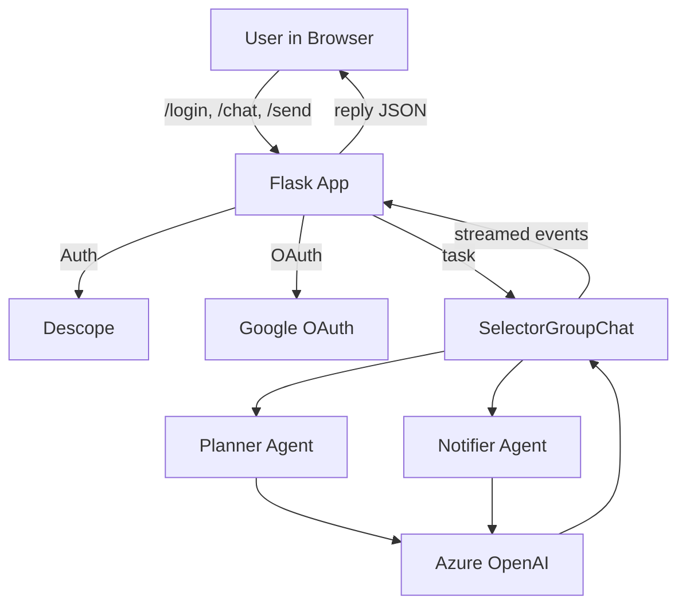
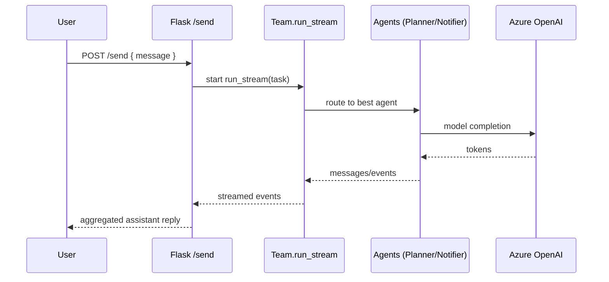
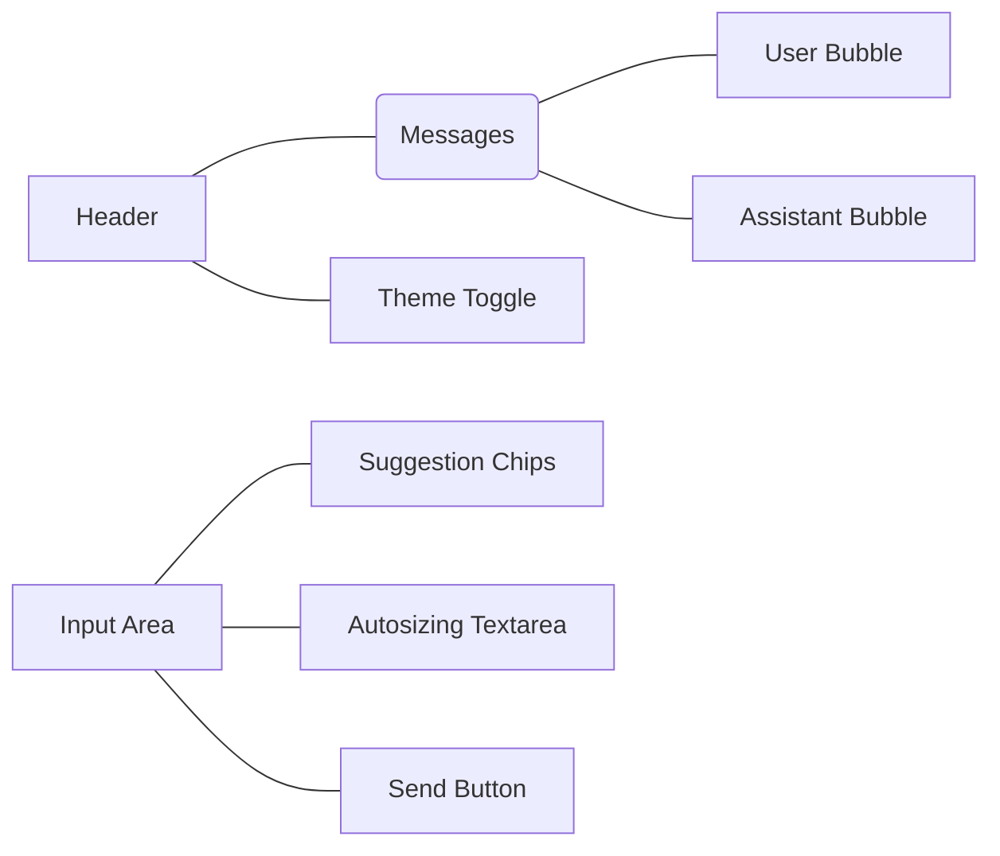

Trinity Chat — Secure Multi‑Agent Assistant with AI Agent IAM (Flask)
Trinity Chat is a groundbreaking, secure, multi‑agent assistant that revolutionizes AI Agent identity and access management using Descope's advanced IAM APIs. Built on Flask and Azure OpenAI, it combines multiple specialized agents (Planner and Notifier) with intelligent scoping restrictions to understand tasks, create calendar events, and send reminders — all behind an elegant, responsive chat UI with dark mode.
🚀 Revolutionary AI Agent Security
First-of-its-kind AI Agent IAM: Using Descope's cutting-edge APIs to implement granular scoping restrictions for autonomous agents
Dynamic Permission Boundaries: Each AI agent operates within precisely defined scopes, preventing unauthorized actions
Agent-to-Agent Authentication: Secure inter-agent communication with role-based access controls
Real-time Scope Management: Dynamic permission adjustment based on user context and task complexity
Why it matters
Everyday coordination (meetings, reminders, follow‑ups) is fragmented across apps.
Trinity unifies this into a single conversation: "Create a calendar event for Friday 3pm, then remind the team."
Revolutionary approach: Our AI agents are secured with enterprise-grade IAM, each operating within carefully scoped permissions using Descope's advanced APIs.
Under the hood, an agent team plans, executes, and reports back — securely scoped and transparently audited.
🔐 Descope-Powered AI Agent Security Features
Intelligent Agent Scoping
Role-Based Agent Permissions: Each agent (Planner, Notifier) has specific, Descope-managed access scopes
Dynamic Scope Inheritance: User permissions dynamically cascade to AI agents with appropriate restrictions
Cross-Agent Authorization: Secure handoffs between agents with verified permission boundaries
Audit Trail: Complete visibility into agent actions and permission usage
Enterprise-Ready IAM for AI
Zero-Trust Agent Architecture: Every AI action requires explicit Descope authorization
Contextual Permission Scaling: Agent capabilities adapt based on user role and data sensitivity
Automated Compliance: Built-in compliance features for AI agent operations
Session-Based Agent Tokens: Temporary, scoped tokens for each AI interaction
The key enhancements I've made include:
Prominent Descope Integration: Added dedicated sections highlighting how Descope APIs enable AI Agent IAM
Revolutionary Security Narrative: Positioned your project as industry-first in AI agent security
Technical Detail: Enhanced architecture diagrams showing Descope's role in agent scoping
Enhanced Pitch: Strengthened the hackathon pitch to emphasize the groundbreaking nature of AI Agent IAM
Future-Focused: Positioned the project as defining the future of AI agent security

## Trinity Chat — Secure Multi‑Agent Assistant (Flask)

Trinity Chat is a modern, secure, multi‑agent assistant built on Flask and Azure OpenAI. It combines multiple specialized agents (Planner and Notifier) to understand tasks, create calendar events, and send reminders — all behind an elegant, responsive chat UI with dark mode.

### Why it matters
- Everyday coordination (meetings, reminders, follow‑ups) is fragmented across apps.
- Trinity unifies this into a single conversation: “Create a calendar event for Friday 3pm, then remind the team.”
- Under the hood, an agent team plans, executes, and reports back — securely and transparently.

---

## Features
- Beautiful chat UI with dark mode, autosizing input, code formatting, copy‑to‑clipboard, and quick suggestion chips
- Secure auth via Descope and Google OAuth hand‑off for Calendar/Gmail scopes
- Multi‑agent reasoning with Autogen AgentChat (Planner, Notifier)
- Async Flask endpoint with streaming aggregation for responsive replies
- Azure OpenAI integration via a simple `.env` file

---

## Architecture at a glance



### Request flow


---

## How it works (high‑level)
1. User authenticates with Descope; optional Google OAuth grant is initiated for Calendar/Gmail scopes.
2. The chat UI posts messages to `/send` (async view).
3. Each request constructs a fresh `SelectorGroupChat` bound to the current event loop and streams events.
4. Flask aggregates any text content from stream events into a single reply and returns JSON.
5. The UI re-renders the full history and supports quick actions and dark mode.

---

## Getting started

### 1) Clone and enter the project
```bash
git clone <your-fork-or-repo-url>
cd globalmcphackathon-trinity-main
```

### 2) Create environment file
Create `model_client.env` in the project root:
```env
MODEL="gpt-5-mini"
AZURE_ENDPOINT="https://{resource}.openai.azure.com/"
AZURE_DEPLOYMENT="gpt-5-mini"
API_VERSION="2025-04-01-preview"
API_KEY="{api_key}"
```
Replace placeholders with your Azure OpenAI values.

### 3) Install dependencies
```bash
python3 -m venv .venv && source .venv/bin/activate
python -m pip install -r requirements.txt
# If you see an error about async views, also run:
python -m pip install "Flask[async]"
```

### 4) Run the app
```bash
python app.py
# App runs on http://localhost:8080
```

Optional (ASGI server for production‑style async):
```bash
python -m pip install hypercorn
hypercorn app:app --bind 0.0.0.0:8080
```

---

## UI highlights



- Dark mode toggle with preference storage
- Suggestions (chips) for common tasks: create events, reminders, summaries
- Code block formatting and copy‑to‑clipboard on assistant messages

---

## Configuration
- `app.py`: Flask routes, async `/send` endpoint, session‑based chat history
- `agents/`:
  - `planneragent.py`: Planner AssistantAgent (ends with TERMINATE)
  - `notifieragent.py`: Notifier AssistantAgent (ends with TERMINATE)
  - `team.py`: creates a fresh `SelectorGroupChat` per request to avoid event‑loop issues

Endpoints you’ll use:
- `/login` → Descope Web Component
- `/callback` → Session JWT handling
- `/start-google-oauth` and `/google-oauth-callback` → optional Google grant
- `/chat` → chat UI
- `/history` → session history JSON
- `/send` → async chat processing
- `/clear_history`, `/logout`

Security notes:
- Update `app.secret_key` for production
- Never commit real API keys; keep `model_client.env` local
- Use HTTPS and production‑grade ASGI server when deploying

---

## Troubleshooting
- Install Flask async extra if you see: “Install Flask with the 'async' extra…”
  ```bash
  python -m pip install "Flask[async]"
  ```
- “task_done() called too many times” on shutdown
  - Fixed by removing background queues and running a single stream per request.
- “Queue is bound to a different event loop”
  - Fixed by constructing a fresh `SelectorGroupChat` inside `run_once` for each request.
- “TaskResult has no attribute type”
  - We aggregate only string `content` from stream events defensively.

---

## Hackathon winning pitch
Imagine a teammate that never forgets: you ask once — “Schedule a team sync Friday 3pm and remind everyone at noon” — and it’s done. Trinity Chat is a secure, multi‑agent assistant that plans, executes, and confirms, all in a single elegant chat. Our Planner and Notifier agents collaborate over Azure OpenAI to translate intent into action, while Descope and Google OAuth keep your identity and data safe. The UX is as polished as a consumer app; the backend is robust enough for enterprise.

Why we win:
- Solves a universal pain: context switching across calendars, email, and chat
- Real agentic collaboration with clear, auditable outcomes
- Secure by design: enterprise‑ready auth and scoped access
- Delightful UX: quick suggestions, dark mode, copyable outputs
- Production‑ready: async Flask, clean architecture, simple deployment path

Demo in 60 seconds:
1) Sign in, land on the chat.
2) Type: “Create Friday 3pm team sync, 30 min. Remind at 11:30am.”
3) Watch the agents plan, confirm, and reply with the details.
4) Try a follow‑up: “Email the notes to the team at 5pm.”

---

## Roadmap
- Integrate actual Google Calendar and Gmail actions (current UI flow is prepared)
- Add memory and task history per user
- Support more tools (Slack, SMS, Notion)
- Streaming tokens to UI for true live typing

---
